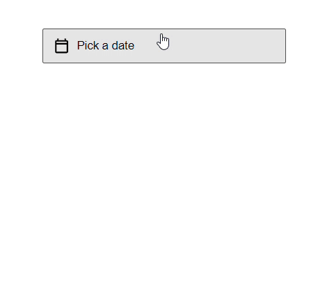

# DatePicker Component

This project implements a reusable `DatePicker` component in React that allows users to pick a date.

## Preview



## Usage

To use the `DatePicker` component in your project, you can include it as shown in the example below:

```tsx
const App = () => {
  const [selectedDate, setSelectedDate] = useState(new Date());

  const updateDate = (date: Date) => {
    setSelectedDate(date);
  };

  return (
    <div>
      <DatePicker onSelect={updateDate} selectedDate={selectedDate} />
    </div>
  );
};
```

## Props

The DatePicker component accepts the following props:

- **`selectedDate`** (optional): The currently selected date. It should be a Date object. If not provided, the date picker will start with the current date.
- **`onSelect`**: A callback function that gets called when a date is selected. The function receives the selected date as a Date object.

```typescript
type DatePickerProps = {
  selectedDate?: Date;
  onSelect: (date: Date) => void;
};
```

## Installation

- Pull this branch into your local system.
- Make sure you have Node installed (preferrably Node v20.11.1).
- Navigate to the project directory and run
  ```
  npm install
  ```
- Once all the dependencies have been installed, run the following command to start the dev server.
  ```
  npm run dev
  ```
